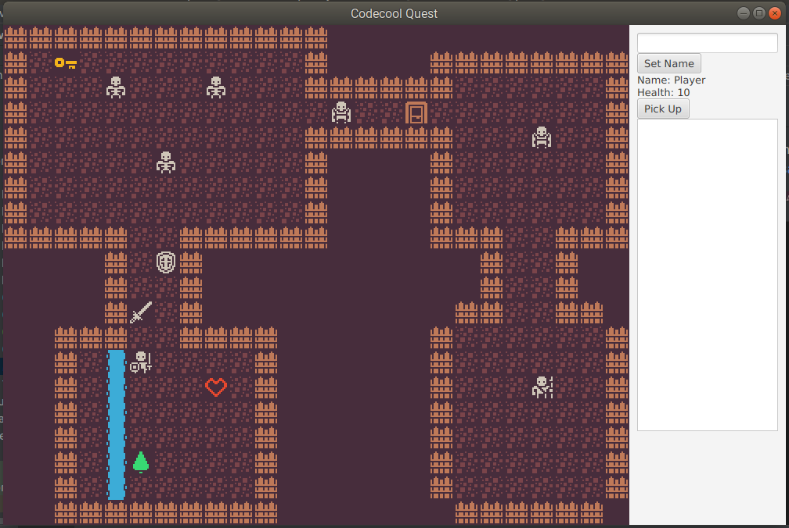
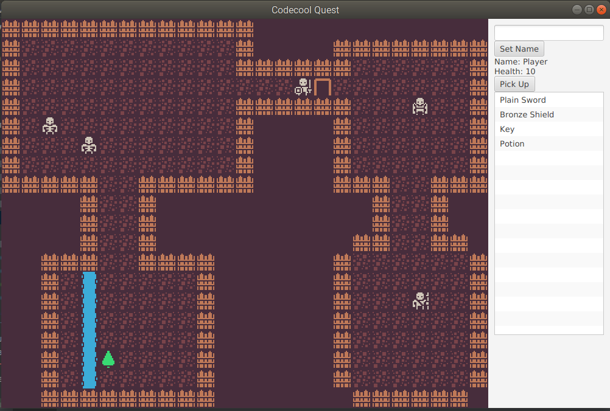

# Codecool Quest

This is a simple tile-based RPG game.

**This project goal was to:**
- practice OOP concept in Java
- practice Object Calisthenics
- practice MVC (Model, View, Controller) design pattern
- use JavaFx as GUI
- use Trello for planning

## Opening the project

Open the project in IntelliJ IDEA. This is a Maven project, so you will need to open `pom.xml`.

The project is using JavaFX, and should work with Oracle's Java 8.

## Architecture

The project is meant to teach the concept of **layer separation**. All of the game logic (that is, player movement, game rules, and so on), is in the `model` package, completely independent of user interface code. In principle, you could implement a completely different interface (terminal, web, Virtual Reality...) for the same logic code.

## Graphics

The tiles used in the game are from [1-Bit Pack by Kenney](https://kenney.nl/assets/bit-pack), shared on [CC0 1.0 Universal license](https://creativecommons.org/publicdomain/zero/1.0/).

##Screenshots

